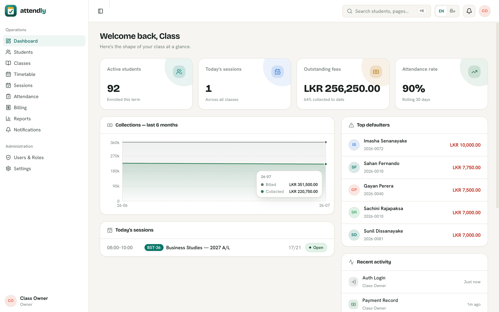
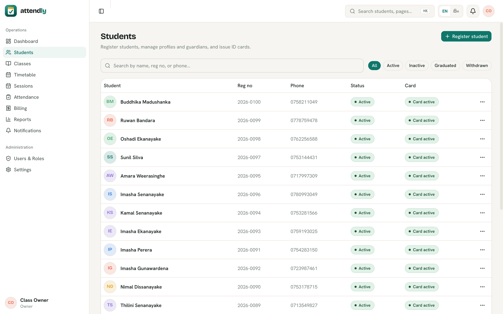
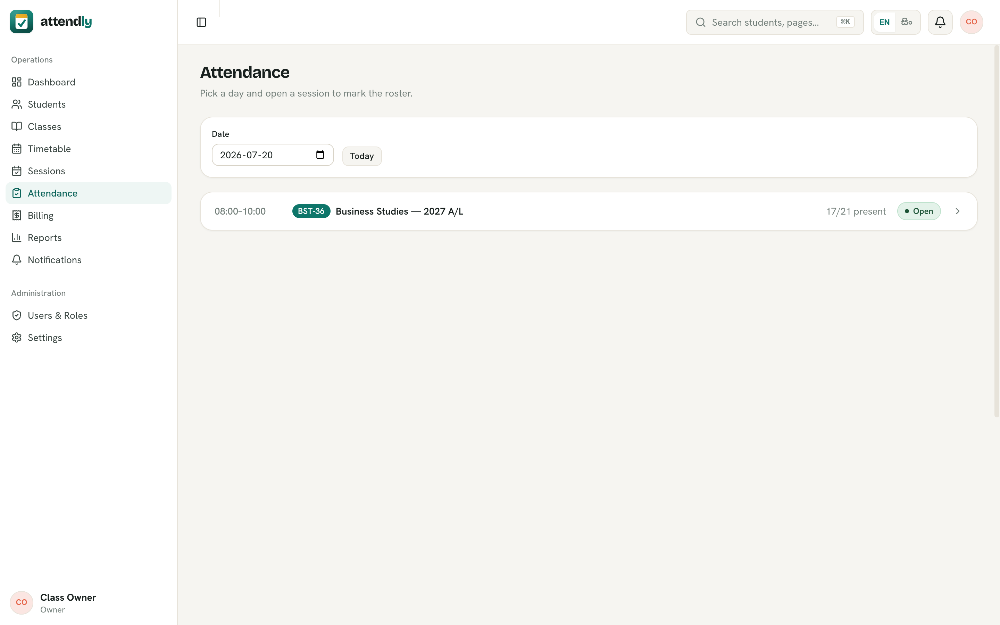
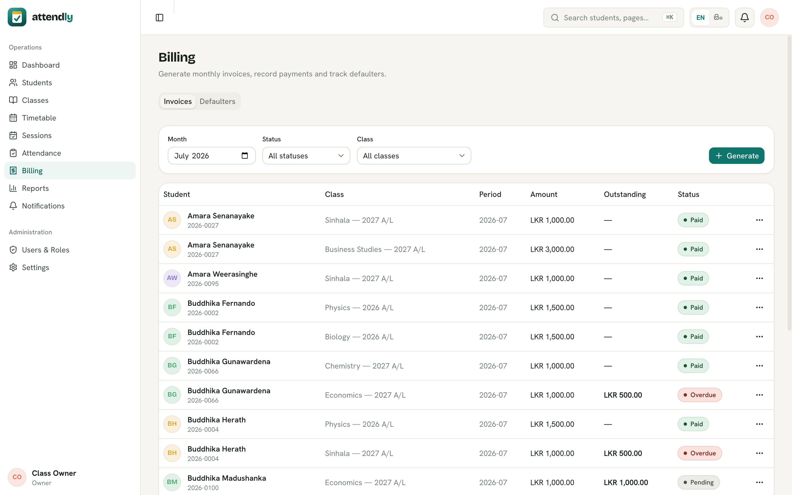
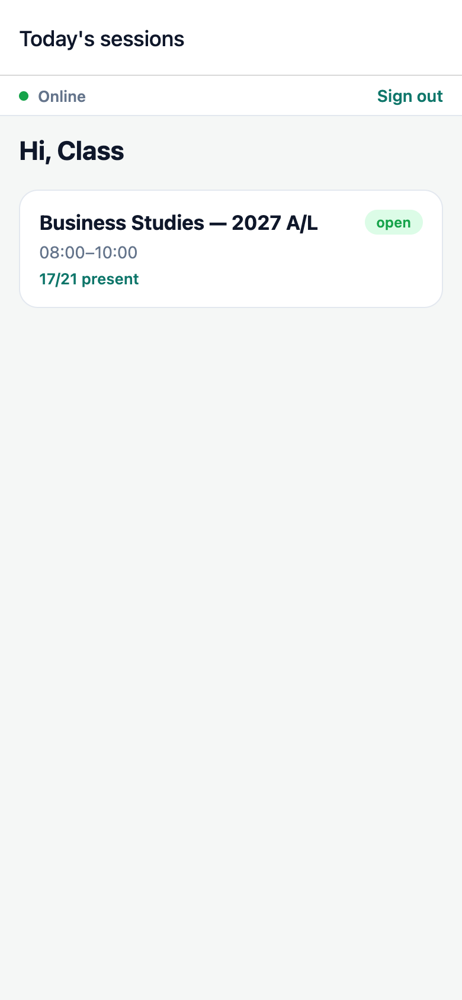
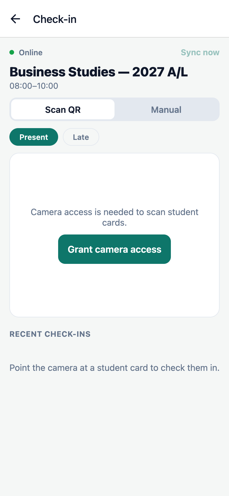
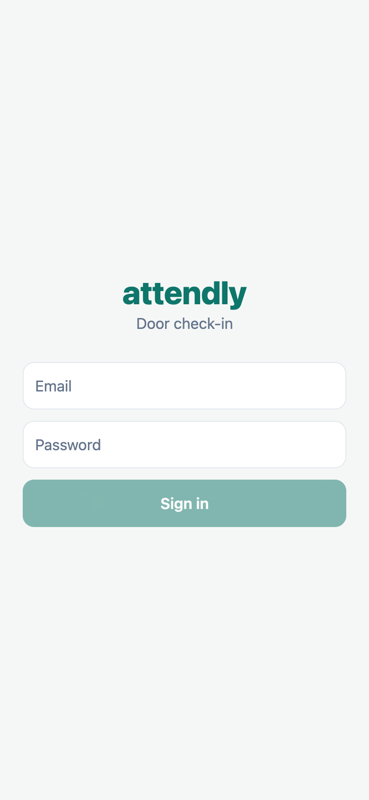
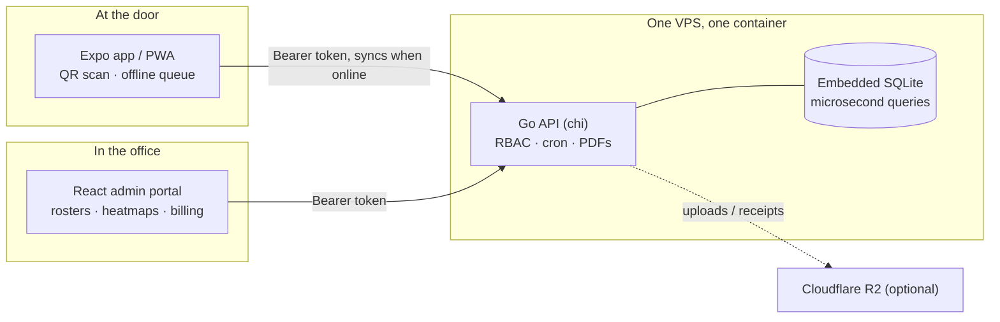

<div align="center">

# Attendly

**Attendance, billing, and notifications for a tuition class. One Go binary, one SQLite file, one door.**

[](https://github.com/prabhavalabs/attendly/actions/workflows/ci.yml)
[](./LICENSE)
[](apps/api)
[](apps/mobile)

A [Prabhava Labs](https://prabhavalabs.com) project · [Live admin](https://attendly.prabhavalabs.com) · [The full story](https://prabhavalabs.com/blog/attendly-story)

</div>

---

This project started with a Reddit post: a teacher running a small tuition
class with no attendance system at all. Paper lists, payment disputes with
no records, everything held together by memory. Commercial school software
wants a school. Attendly is sized for one teacher with 100+ students, open
source, and self-hosted on whatever cheap VPS you already have.

## The admin portal

Rosters, attendance heatmaps, invoices, and defaulter tracking for the
office side of running a class.

| Dashboard | Students |
| :---: | :---: |
|  |  |

| Attendance | Billing |
| :---: | :---: |
|  |  |

## The door check-in app

The system lives or dies at the classroom door when eighty students arrive
in twenty minutes. The Expo mobile app (also installable as a PWA) is built
for exactly that moment: scan a student's QR card or search a name, tap
present or late, watch the counts update live.

It is **offline-first**: marks queue locally when the connection dies and
sync when it returns. The door never waits for a spinner.

| Sessions | Check-in (QR + manual) | Entry |
| :---: | :---: | :---: |
|  |  |  |

## How it fits together



No database server, no queue, no second container. The whole persistent
state of the class is one SQLite file inside one process; backing up the
system means backing up a file. For a class of this size, queries return in
microseconds because there is no network between the app and its data.

## Monorepo layout

| Path | What |
|------|------|
| `apps/api` | Go backend (chi) + embedded SQLite: business logic, RBAC, cron, PDFs |
| `apps/admin` | React + Vite admin portal |
| `apps/mobile` | Expo app + PWA: door check-in |
| `packages/shared` | Zod schemas, permission catalog, default roles |

## Run it in five minutes

```bash
make up         # install deps, create apps/api/.env (generated dev secrets)

make backend    # terminal 1: Go API on :8787 (migrations auto-apply on boot)
make admin      # terminal 2: admin portal on :5173
make seed       # once: create the owner account
# then open http://localhost:5173 and sign in as owner@attendly.lk
```

Want it populated before trusting it with real students? The demo seeder
creates 172 fake students, four classes, thousands of attendance records,
and realistic invoices (paid, partial, defaulters):

```bash
node scripts/seed-demo.mjs
```

Every screenshot above is that demo data. Run `make help` for all targets.

## Deploying

One Docker container behind nginx and Cloudflare, deployed by GitHub
Actions on every merge to `main`. The full recipe, including DNS, the
nginx vhost, and CI secrets, is in [DEPLOYMENT.md](./DEPLOYMENT.md).
Requirements live in [docs/srs.md](./docs/srs.md).

## License

[MIT](./LICENSE). Built in the open by
[Prabhava Labs](https://prabhavalabs.com), where every project ships with
[its story](https://prabhavalabs.com/blog/attendly-story).
